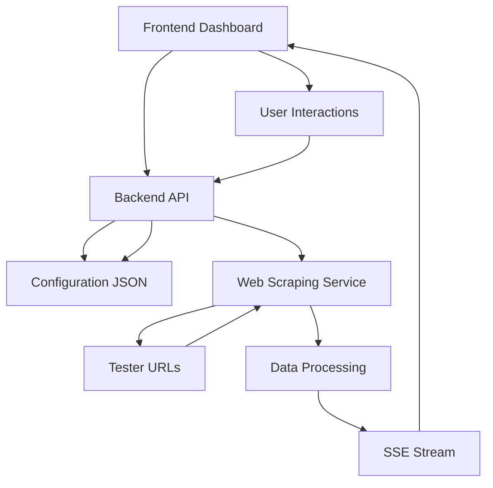

# Tester Monitoring System

A lightweight real-time monitoring dashboard for tracking tester status by scraping data from multiple tester URLs.

## Overview

This system provides a unified dashboard to monitor the status of multiple testers by fetching and parsing data from their individual HTML pages. It features real-time updates, configurable display settings, and a responsive design optimized for monitoring environments.

## Features

- **Real-time Monitoring**: Live status updates using Server-Sent Events
- **Configurable Dashboard**: Adjustable layout with 1-5 testers per row
- **Tester Management**: Add, edit, and remove testers through the UI
- **Auto-refresh**: Configurable refresh intervals (minimum 15 seconds)
- **Responsive Design**: Works on desktop, tablet, and mobile devices
- **Lightweight Architecture**: Minimal resource usage to avoid impacting other processes
- **Docker Deployment**: Easy deployment with Docker Compose

## Technology Stack

- **Backend**: Bun runtime on Alpine Linux
- **Frontend**: Vanilla HTML/CSS/JavaScript
- **Web Scraping**: Axios + Cheerio
- **Real-time Communication**: Server-Sent Events (SSE)
- **Storage**: JSON file configuration
- **Deployment**: Docker Compose

## Quick Start

1. Clone the repository
2. Configure environment variables
3. Start with Docker Compose
4. Access the application

```bash
git clone <repository-url>
cd tester-monitoring
cp .env.example .env
docker-compose up -d
```

Access the application at `http://localhost:3000`

## Architecture

The system consists of three main components:

1. **Backend Server**: Handles data fetching, processing, and real-time updates
2. **Frontend Dashboard**: Displays tester status and provides configuration UI
3. **Configuration Storage**: JSON-based storage for tester settings

### Data Flow



## Documentation

- [Architecture Overview](architecture.md) - System architecture and component design
- [Implementation Plan](implementation-plan.md) - Detailed implementation roadmap
- [Web Scraping Specification](scraping-specification.md) - Data extraction details
- [UI/UX Specification](ui-ux-specification.md) - User interface design
- [API Specification](api-specification.md) - REST API and SSE documentation
- [Deployment Guide](deployment-guide.md) - Deployment instructions and configuration

## Configuration

### Tester Configuration

The system monitors testers configured in the JSON configuration file:

```json
{
  "testers": [
    {
      "id": "ist13",
      "display_name": "IST13",
      "url": "http://192.168.140.114:8080"
    }
  ],
  "displaySettings": {
    "testersPerRow": 3,
    "refreshInterval": 15
  }
}
```

### Display Settings

- **Testers per row**: 1-5 (default: 3)
- **Refresh interval**: 15+ seconds (default: 15)

## Data Extraction

The system extracts the following data from each tester URL:

### Slot Card Information
- Slot ID (e.g., SLOT01)
- Status (passed, failed, testing, etc.)
- Serial Number
- Test Time
- Production Type
- Project Name

### Summary Statistics
- Number of slots in each status
- Overall tester status
- Last update timestamp

## Development

### Prerequisites

- Node.js 18+ (for local development)
- Bun 1.0+ (for backend)
- Docker & Docker Compose (for deployment)

### Local Development

```bash
# Backend
cd backend
bun install
bun run dev

# Frontend (serve with any HTTP server)
cd frontend
python -m http.server 8080
```

### Project Structure

```
tester-monitoring/
├── backend/                 # Bun backend application
│   ├── src/                # Source code
│   ├── package.json        # Dependencies
│   └── Dockerfile          # Docker configuration
├── frontend/               # Web frontend
│   ├── css/                # Stylesheets
│   ├── js/                 # JavaScript modules
│   └── index.html          # Main page
├── docker-compose.yml      # Docker Compose configuration
└── docs/                   # Documentation
```

## Deployment

### Production Deployment

```bash
# Create production environment
cp .env.example .env
# Edit .env with production values

# Start services
docker-compose -f docker-compose.yml --profile production up -d

# Verify deployment
curl http://localhost/api/status
```

### SSL Configuration

For production environments, configure SSL/TLS:

1. Update nginx configuration with SSL certificates
2. Update environment variables for HTTPS
3. Restart services

## Monitoring and Maintenance

### Health Checks

```bash
# Check container status
docker-compose ps

# Check application health
curl http://localhost/api/status

# View logs
docker-compose logs -f
```

### Backup Configuration

```bash
# Backup configuration file
docker cp $(docker-compose ps -q backend):/app/data/config.json ./config-backup.json
```

## Troubleshooting

### Common Issues

1. **Can't access tester URLs**
   - Verify network connectivity
   - Check firewall settings
   - Test URL accessibility

2. **High memory usage**
   - Reduce concurrent requests
   - Increase refresh interval
   - Monitor with `docker stats`

3. **Data not updating**
   - Check SSE connection status
   - Verify refresh interval settings
   - Review browser console for errors

## Security Considerations

- Network isolation using Docker networks
- Rate limiting for API endpoints
- SSL/TLS for production environments
- Regular security updates

## Contributing

1. Fork the repository
2. Create a feature branch
3. Make your changes
4. Add tests if applicable
5. Submit a pull request

## License

This project is licensed under the MIT License - see the LICENSE file for details.

## Support

For support and questions:
- Create an issue in the repository
- Review the documentation in the docs/ folder
- Check the troubleshooting section