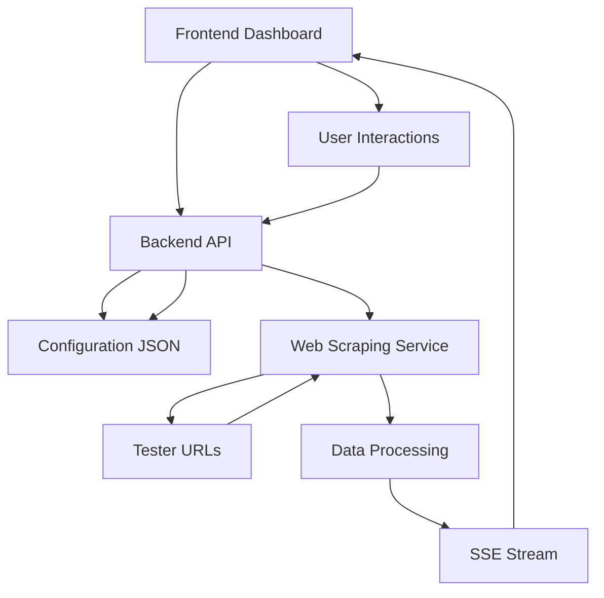

# Tester Monitoring System Architecture

## System Overview
A lightweight real-time tester monitoring dashboard that fetches data from multiple tester URLs and displays the status in a unified interface.

## Technology Stack
- **Backend**: Bun runtime on Alpine Linux
- **Frontend**: Vanilla HTML/CSS/JavaScript
- **Web Scraping**: Axios + Cheerio
- **Real-time Communication**: Server-Sent Events (SSE)
- **Storage**: JSON file configuration
- **Deployment**: Docker Compose

## System Components

### Backend (Bun Server)
```
┌─────────────────────────────────────┐
│           Bun Server                │
├─────────────────────────────────────┤
│ • Web Scraping Service              │
│   - Axios for HTTP requests         │
│   - Cheerio for HTML parsing        │
│ • Configuration Manager             │
│   - JSON file operations            │
│   - Tester CRUD operations          │
│ • SSE Endpoint                      │
│   - Real-time data streaming        │
│ • REST API                          │
│   - Configuration endpoints         │
│   - Tester management               │
└─────────────────────────────────────┘
```

### Frontend (Web Dashboard)
```
┌─────────────────────────────────────┐
│          Web Dashboard              │
├─────────────────────────────────────┤
│ • Collapsible Menu Bar              │
│   - Tester selection                │
│   - Configuration options           │
│ • Main Dashboard                    │
│   - Tester cards grid               │
│   - Slot sub-cards                  │
│ • Configuration Modal               │
│   - Add/Edit/Delete testers         │
│   - Display settings                │
│ • SSE Client                        │
│   - Real-time updates               │
└─────────────────────────────────────┘
```

## Data Flow



## Data Structure

### Tester Configuration (config.json)
```json
{
  "testers": [
    {
      "id": "ist13",
      "display_name": "IST13",
      "url": "http://192.168.140.114:8080"
    }
  ],
  "displaySettings": {
    "testersPerRow": 3,
    "refreshInterval": 15
  }
}
```

### Scraped Data Structure
```json
{
  "testerId": "ist13",
  "status": "PASSED",
  "timestamp": "2025-10-17T10:40:00Z",
  "slots": [
    {
      "slotId": "SLOT01",
      "status": "passed",
      "sn": "SFT",
      "testTime": "1:19:45",
      "serialNumber": "332404254207449",
      "production": "Production",
      "project": "AZ3324_2025.10.08-01"
    }
  ],
  "summary": {
    "testing": 12,
    "failing": 0,
    "passed": 3,
    "failed": 1,
    "aborted": 0
  }
}
```

## Key Features

### 1. Web Scraping Logic
- Fetch HTML from tester URLs
- Parse slot data using CSS selectors:
  - `.panel-heading .chassisname` for slot ID
  - `.panel-heading .slot-sn` for slot SN
  - `.panel-heading .chassisstatus` for status
  - `.panel-heading .testtime` for test time
  - `.panel-body .slot-sn` for serial number
  - `.panel-footer .slot-sn` for production info

### 2. Real-time Updates
- Server-Sent Events for pushing updates
- Configurable refresh intervals (minimum 15 seconds)
- Automatic reconnection handling

### 3. Configuration Management
- Add/remove/edit testers
- Configure display settings (testers per row, refresh interval)
- Persistent storage in JSON file

### 4. Responsive UI
- Collapsible left menu bar
- Grid layout with configurable columns
- Scrollable slot cards within tester cards
- Click-to-navigate functionality

## Deployment Architecture

```mermaid
graph LR
    A[Docker Compose] --> B[Bun Alpine Container]
    A --> C[Nginx Container (Optional)]
    B --> D[Volume Mounts]
    D --> E[config.json]
    D --> F[logs]
    C --> G[Static Files]
    B --> H[Port 3000]
```

## Performance Considerations
- Lightweight design to minimize resource usage
- Efficient HTML parsing with Cheerio
- Incremental updates via SSE
- Configurable refresh intervals to prevent excessive requests
- Error handling and retry logic for failed requests